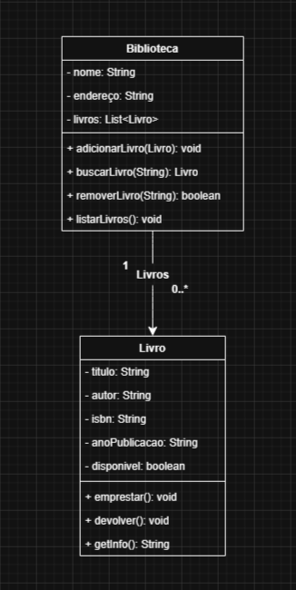
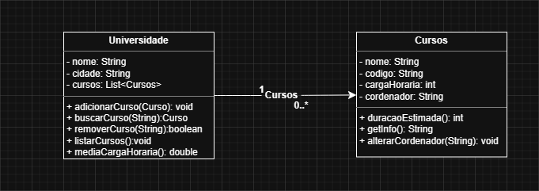

# Engenharia de Software

### 1. Programação vs. Engenharia de Software
Apesar de muita gente usar 'programação' e 'engenharia de software' como se fossem a mesma coisa, existe uma diferença importante:
*   **Programar** é basicamente escrever código.
*   **Engenharia de Software** envolve aplicar métodos mais organizados e cuidadosos, parecidos com o que acontece em outras engenharias.

Como o software hoje faz parte do nosso dia a dia de forma tão intensa, acaba sendo necessário adotar práticas mais rigorosas para garantir qualidade e confiabilidade. É nesse ponto que a experiência do Google pode trazer uma visão única, mostrando caminhos para práticas mais sólidas no desenvolvimento.

### 2. O que é Engenharia de Software?
O livro mostra que engenharia de software vai além de só escrever código: envolve práticas e processos que mantêm o código útil e sustentável ao longo do tempo. A ideia central é enxergar engenharia de software como **'programação integrada no tempo'**, lidando com mudanças, manutenção e até a descontinuação.

Para isso, eles destacam três pontos principais:
1.  Como o código precisa se adaptar ao longo da vida.
2.  Como a organização cresce e precisa mudar junto.
3.  Como tomar decisões equilibrando custos e benefícios.

A proposta é que a experiência do Google ajude a pensar em caminhos para tornar o desenvolvimento mais sólido e duradouro.

### 3. Trade-offs Fundamentais no Desenvolvimento

| Trade-off | Descrição |
| :--- | :--- |
| **Velocidade x Qualidade** | Se você quiser entregar rápido, pode abrir mão de testes e boas práticas, mas isso aumenta a chance de bugs e problemas no futuro. Se optar por qualidade, leva mais tempo, mas o sistema fica mais sustentável. |
| **Performance x Manutenibilidade** | Um código super otimizado pode ser rápido, mas também mais complexo e difícil de entender. Já um código mais simples e claro pode ser mais lento, mas facilita a manutenção e a entrada de novos desenvolvedores. |
| **Custo x Escalabilidade** | Investir em uma arquitetura robusta e escalável desde o início custa mais caro e pode ser desnecessário no começo. Por outro lado, começar simples é mais barato, mas pode gerar gastos maiores no futuro quando for preciso escalar. |

---
### 4. Diagrama de Classes UML
#### Diagrama1


#### Classes1
```Java
//Biblioteca.java
package biblioteca;

import java.util.ArrayList;
import java.util.List;

public class Biblioteca {
    private String nome;
    private String endereco;
    private List<Livro> livros;
    
    public Biblioteca(String nome, String endereco) {
        this.nome = nome;
        this.endereco = endereco;
        this.livros = new ArrayList<>();
    }
    
    public void adicionarLivro(Livro livro) {
        livros.add(livro);
        System.out.println("Livro '" + livro.getTitulo() + "' adicionado à biblioteca.");
    }
    
    public Livro buscarLivro(String titulo) {
        for (Livro livro : livros) {
            if (livro.getTitulo().equalsIgnoreCase(titulo)) {
                return livro;
            }
        }
        System.out.println("Livro '" + titulo + "' não encontrado.");
        return null;
    }
    
    public boolean removerLivro(String isbn) {
        for (int i = 0; i < livros.size(); i++) {
            if (livros.get(i).getIsbn().equals(isbn)) {
                Livro removido = livros.remove(i);
                System.out.println("Livro '" + removido.getTitulo() + "' removido da biblioteca.");
                return true;
            }
        }
        System.out.println("Livro com ISBN '" + isbn + "' não encontrado.");
        return false;
    }
    
    public void listarLivros() {
        if (livros.isEmpty()) {
            System.out.println("A biblioteca não possui livros cadastrados.");
            return;
        }
        
        System.out.println("\n=== LIVROS DA BIBLIOTECA ===");
        for (int i = 0; i < livros.size(); i++) {
            System.out.println((i + 1) + ". " + livros.get(i).getInfo());
        }
    }
    
    public String getNome() { return nome; }
    public String getEndereco() { return endereco; }
    public List<Livro> getLivros() { return livros; }
}

//Livro.java
package biblioteca;

public class Livro {
    private String titulo;
    private String autor;
    private String isbn;
    private String anoPublicacao;
    private boolean disponivel;
    
    public Livro(String titulo, String autor, String isbn, String anoPublicacao) {
        this.titulo = titulo;
        this.autor = autor;
        this.isbn = isbn;
        this.anoPublicacao = anoPublicacao;
        this.disponivel = true;
    }
    
    public void emprestar() {
        if (disponivel) {
            disponivel = false;
            System.out.println("Livro '" + titulo + "' emprestado com sucesso.");
        } else {
            System.out.println("Livro '" + titulo + "' não está disponível para empréstimo.");
        }
    }
    
    public void devolver() {
        disponivel = true;
        System.out.println("Livro '" + titulo + "' devolvido com sucesso.");
    }
    
    public String getInfo() {
        return String.format("Título: %s, Autor: %s, ISBN: %s, Ano: %s, Disponível: %s",
                titulo, autor, isbn, anoPublicacao, disponivel ? "Sim" : "Não");
    }
    
    public String getTitulo() { return titulo; }
    public String getAutor() { return autor; }
    public String getIsbn() { return isbn; }
    public String getAnoPublicacao() { return anoPublicacao; }
    public boolean isDisponivel() { return disponivel; }
}
```
#### Testes1
```Java
//BibliotecaTests.java
package biblioteca;

import org.junit.jupiter.api.BeforeEach;
import org.junit.jupiter.api.Test;
import static org.junit.jupiter.api.Assertions.*;

public class BibliotecaTest {
    private Biblioteca biblioteca;
    private Livro livro1;
    private Livro livro2;

    @BeforeEach
    void setUp() {
        biblioteca = new Biblioteca("Biblioteca Central", "Rua Principal, 123");
        livro1 = new Livro("Dom Casmurro", "Machado de Assis", "978-85-123-4567-8", "1899");
        livro2 = new Livro("O Cortiço", "Aluísio Azevedo", "978-85-987-6543-2", "1890");
    }

    @Test
    void testAdicionarLivro() {
        biblioteca.adicionarLivro(livro1);
        assertEquals(1, biblioteca.getLivros().size());
        assertEquals("Dom Casmurro", biblioteca.getLivros().get(0).getTitulo());
    }

    @Test
    void testBuscarLivroExistente() {
        biblioteca.adicionarLivro(livro1);
        biblioteca.adicionarLivro(livro2);
        
        Livro livroEncontrado = biblioteca.buscarLivro("Dom Casmurro");
        assertNotNull(livroEncontrado);
        assertEquals("978-85-123-4567-8", livroEncontrado.getIsbn());
    }

    @Test
    void testBuscarLivroNaoExistente() {
        biblioteca.adicionarLivro(livro1);
        
        Livro livroEncontrado = biblioteca.buscarLivro("Memórias Póstumas");
        assertNull(livroEncontrado);
    }

    @Test
    void testBuscarLivroCaseInsensitive() {
        biblioteca.adicionarLivro(livro1);
        
        Livro livroEncontrado = biblioteca.buscarLivro("dom casmurro");
        assertNotNull(livroEncontrado);
        assertEquals("Dom Casmurro", livroEncontrado.getTitulo());
    }

    @Test
    void testRemoverLivroExistente() {
        biblioteca.adicionarLivro(livro1);
        biblioteca.adicionarLivro(livro2);
        
        boolean removido = biblioteca.removerLivro("978-85-123-4567-8");
        assertTrue(removido);
        assertEquals(1, biblioteca.getLivros().size());
        assertEquals("O Cortiço", biblioteca.getLivros().get(0).getTitulo());
    }

    @Test
    void testRemoverLivroNaoExistente() {
        biblioteca.adicionarLivro(livro1);
        
        boolean removido = biblioteca.removerLivro("ISBN-INEXISTENTE");
        assertFalse(removido);
        assertEquals(1, biblioteca.getLivros().size());
    }

    @Test
    void testListarLivrosVazio() {
        assertDoesNotThrow(() -> biblioteca.listarLivros());
    }

    @Test
    void testGettersBiblioteca() {
        assertEquals("Biblioteca Central", biblioteca.getNome());
        assertEquals("Rua Principal, 123", biblioteca.getEndereco());
    }
}

//LivroTests.java
package biblioteca;

import static org.junit.jupiter.api.Assertions.assertEquals;
import static org.junit.jupiter.api.Assertions.assertFalse;
import static org.junit.jupiter.api.Assertions.assertTrue;

import org.junit.jupiter.api.BeforeEach;
import org.junit.jupiter.api.Test;

public class LivroTest {
    private Livro livro;

    @BeforeEach
    void setUp() {
        livro = new Livro("Dom Casmurro", "Machado de Assis", "978-85-123-4567-8", "1899");
    }

    @Test
    void testEmprestarLivroDisponivel() {
        assertTrue(livro.isDisponivel());
        livro.emprestar();
        assertFalse(livro.isDisponivel());
    }

    @Test
    void testEmprestarLivroIndisponivel() {
        livro.emprestar();
        assertFalse(livro.isDisponivel());
        

        livro.emprestar();
        assertFalse(livro.isDisponivel());
    }

    @Test
    void testDevolverLivro() {
        livro.emprestar();
        assertFalse(livro.isDisponivel());
        
        livro.devolver();
        assertTrue(livro.isDisponivel());
    }

    @Test
    void testDevolverLivroJaDisponivel() {
        assertTrue(livro.isDisponivel());
        livro.devolver();
        assertTrue(livro.isDisponivel());
    }

    @Test
    void testGetInfo() {
        String info = livro.getInfo();
        assertTrue(info.contains("Dom Casmurro"));
        assertTrue(info.contains("Machado de Assis"));
        assertTrue(info.contains("978-85-123-4567-8"));
        assertTrue(info.contains("1899"));
        assertTrue(info.contains("Disponível: Sim"));
    }

    @Test
    void testGetInfoAposEmprestimo() {
        livro.emprestar();
        String info = livro.getInfo();
        assertTrue(info.contains("Disponível: Não"));
    }

    @Test
    void testGettersLivro() {
        assertEquals("Dom Casmurro", livro.getTitulo());
        assertEquals("978-85-123-4567-8", livro.getIsbn());
    }
}
```

#### Diagrama2


#### Classes2
```Java
//Universidade.java
package universidade;

import java.util.ArrayList;
import java.util.List;

public class Universidade {
    private String nome;
    private String cidade;
    private List<Curso> cursos;
    
    public Universidade(String nome, String cidade) {
        this.nome = nome;
        this.cidade = cidade;
        this.cursos = new ArrayList<>();
    }
    
    public void adicionarCurso(Curso curso) {
        cursos.add(curso);
        System.out.println("Curso '" + curso.getNome() + "' adicionado à universidade.");
    }
    
    public Curso buscarCurso(String nome) {
        for (Curso curso : cursos) {
            if (curso.getNome().equalsIgnoreCase(nome)) {
                return curso;
            }
        }
        System.out.println("Curso '" + nome + "' não encontrado.");
        return null;
    }
    
    public boolean removeCurso(String codigo) {
        for (int i = 0; i < cursos.size(); i++) {
            if (cursos.get(i).getCodigo().equals(codigo)) {
                Curso removido = cursos.remove(i);
                System.out.println("Curso '" + removido.getNome() + "' removido da universidade.");
                return true;
            }
        }
        System.out.println("Curso com código '" + codigo + "' não encontrado.");
        return false;
    }
    
    public void listarCursos() {
        if (cursos.isEmpty()) {
            System.out.println("A universidade não possui cursos cadastrados.");
            return;
        }
        
        System.out.println("\n=== CURSOS DA UNIVERSIDADE ===");
        for (int i = 0; i < cursos.size(); i++) {
            System.out.println((i + 1) + ". " + cursos.get(i).getInfo());
        }
    }
    
    public double mediaCargaHoraria() {
        if (cursos.isEmpty()) {
            return 0.0;
        }
        
        int total = 0;
        for (Curso curso : cursos) {
            total += curso.getCargaHoraria();
        }
        
        return (double) total / cursos.size();
    }
    
    public String getNome() { return nome; }
    public String getCidade() { return cidade; }
    public List<Curso> getCursos() { return cursos; }
}

//Curso.java
package universidade;

public class Curso {
    private String nome;
    private String codigo;
    private int cargaHoraria;
    private String coordenador;
    
    public Curso(String nome, String codigo, int cargaHoraria, String coordenador) {
        this.nome = nome;
        this.codigo = codigo;
        this.cargaHoraria = cargaHoraria;
        this.coordenador = coordenador;
    }
    
    public int duracaoEstimada() {
        return (int) Math.ceil(cargaHoraria / 200.0);
    }
    
    public String getInfo() {
        return String.format("Curso: %s, Código: %s, Carga Horária: %d h, Coordenador: %s, Duração Estimada: %d semestres",
                nome, codigo, cargaHoraria, coordenador, duracaoEstimada());
    }
    
    public void alterarCoordenador(String novoCoordenador) {
        this.coordenador = novoCoordenador;
        System.out.println("Coordenador do curso '" + nome + "' alterado para: " + novoCoordenador);
    }
    

    public String getNome() { return nome; }
    public String getCodigo() { return codigo; }
    public int getCargaHoraria() { return cargaHoraria; }
    public String getCoordenador() { return coordenador; }
    

    public void setCoordenador(String coordenador) { this.coordenador = coordenador; }
}
```

#### Testes2
```Java
//UniversidadeTests.java
package universidade;

import org.junit.jupiter.api.BeforeEach;
import org.junit.jupiter.api.Test;
import static org.junit.jupiter.api.Assertions.*;

public class UniversidadeTest {
    private Universidade universidade;
    private Curso curso1;
    private Curso curso2;

    @BeforeEach
    void setUp() {
        universidade = new Universidade("UFSC", "Florianópolis");
        curso1 = new Curso("Engenharia de Software", "ESW001", 3200, "Dr. João Silva");
        curso2 = new Curso("Ciência da Computação", "CC001", 3000, "Dra. Maria Santos");
    }

    @Test
    void testAdicionarCurso() {
        universidade.adicionarCurso(curso1);
        assertEquals(1, universidade.getCursos().size());
        assertEquals("Engenharia de Software", universidade.getCursos().get(0).getNome());
    }

    @Test
    void testBuscarCursoExistente() {
        universidade.adicionarCurso(curso1);
        universidade.adicionarCurso(curso2);
        
        Curso cursoEncontrado = universidade.buscarCurso("Engenharia de Software");
        assertNotNull(cursoEncontrado);
        assertEquals("ESW001", cursoEncontrado.getCodigo());
    }

    @Test
    void testBuscarCursoNaoExistente() {
        universidade.adicionarCurso(curso1);
        
        Curso cursoEncontrado = universidade.buscarCurso("Medicina");
        assertNull(cursoEncontrado);
    }

    @Test
    void testRemoverCursoExistente() {
        universidade.adicionarCurso(curso1);
        universidade.adicionarCurso(curso2);
        
        boolean removido = universidade.removeCurso("ESW001");
        assertTrue(removido);
        assertEquals(1, universidade.getCursos().size());
        assertEquals("Ciência da Computação", universidade.getCursos().get(0).getNome());
    }

    @Test
    void testRemoverCursoNaoExistente() {
        universidade.adicionarCurso(curso1);
        
        boolean removido = universidade.removeCurso("COD999");
        assertFalse(removido);
        assertEquals(1, universidade.getCursos().size());
    }

    @Test
    void testListarCursosVazio() {
        assertDoesNotThrow(() -> universidade.listarCursos());
    }

    @Test
    void testMediaCargaHoraria() {
        universidade.adicionarCurso(curso1);
        universidade.adicionarCurso(curso2);
        
        double media = universidade.mediaCargaHoraria();
        assertEquals(3100.0, media, 0.01);
    }

    @Test
    void testMediaCargaHorariaSemCursos() {
        double media = universidade.mediaCargaHoraria();
        assertEquals(0.0, media, 0.01);
    }
}


//CursoTests.java
package universidade;

import static org.junit.jupiter.api.Assertions.assertEquals;
import static org.junit.jupiter.api.Assertions.assertTrue;

import org.junit.jupiter.api.BeforeEach;
import org.junit.jupiter.api.Test;

public class CursoTest {
    private Curso curso;

    @BeforeEach
    void setUp() {
        curso = new Curso("Engenharia de Software", "ESW001", 3200, "Dr. João Silva");
    }

    @Test
    void testDuracaoEstimada() {
        int duracao = curso.duracaoEstimada();
        assertEquals(16, duracao);
    }

    @Test
    void testGetInfo() {
        String info = curso.getInfo();
        assertTrue(info.contains("Engenharia de Software"));
        assertTrue(info.contains("ESW001"));
        assertTrue(info.contains("3200"));
        assertTrue(info.contains("Dr. João Silva"));
    }

    @Test
    void testAlterarCoordenador() {
        curso.alterarCoordenador("Dr. Pedro Oliveira");
        assertEquals("Dr. Pedro Oliveira", curso.getCoordenador());
    }

    @Test
    void testGetters() {
        assertEquals("Engenharia de Software", curso.getNome());
        assertEquals("ESW001", curso.getCodigo());
        assertEquals(3200, curso.getCargaHoraria());
        assertEquals("Dr. João Silva", curso.getCoordenador());
    }
}
```
### Main File
```Java
package main;

import biblioteca.*;
import universidade.*;

import org.junit.platform.launcher.Launcher;
import org.junit.platform.launcher.LauncherDiscoveryRequest;
import org.junit.platform.launcher.core.LauncherDiscoveryRequestBuilder;
import org.junit.platform.launcher.core.LauncherFactory;
import org.junit.platform.launcher.listeners.SummaryGeneratingListener;
import org.junit.platform.launcher.listeners.TestExecutionSummary; 

import static org.junit.platform.engine.discovery.DiscoverySelectors.selectClass;

public class Main {
    public static void main(String[] args) {
        SummaryGeneratingListener listener = new SummaryGeneratingListener();

        LauncherDiscoveryRequest request = LauncherDiscoveryRequestBuilder.request()
                .selectors(
                    selectClass(UniversidadeTest.class),
                    selectClass(CursoTest.class),
                    selectClass(BibliotecaTest.class),
                    selectClass(LivroTest.class)
                )
                .build();

        Launcher launcher = LauncherFactory.create();
        launcher.registerTestExecutionListeners(listener);
        launcher.execute(request);

        TestExecutionSummary summary = listener.getSummary();
        
        System.out.println("=== RESULTADO DOS TESTES ===");
        System.out.println("Testes executados: " + summary.getTestsFoundCount());
        System.out.println("Testes passaram: " + summary.getTestsSucceededCount());
        System.out.println("Testes falharam: " + summary.getTestsFailedCount());
        System.out.println("Tempo total: " + summary.getTimeFinished() + "ms");
        
        if (summary.getTestsFailedCount() > 0) {
            summary.getFailures().forEach(failure -> 
                System.out.println("Falha: " + failure.getTestIdentifier().getDisplayName() + " - " + failure.getException()));
        }
    }
}

```